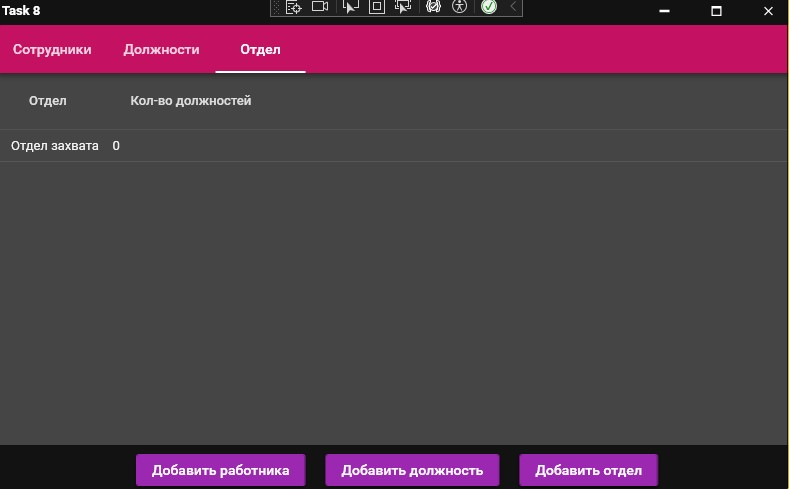
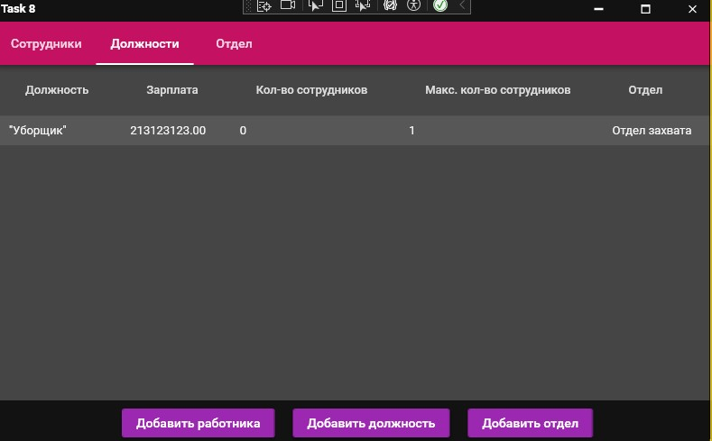
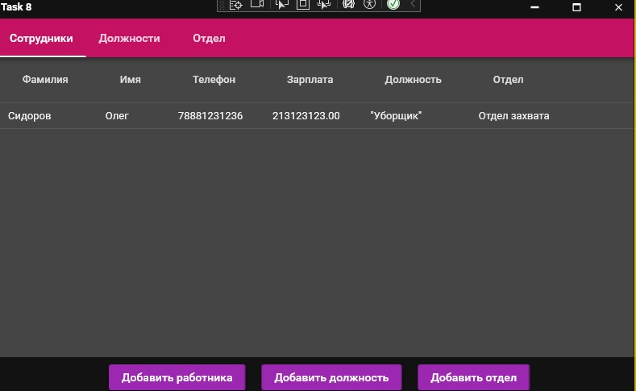

<h1>Задание 8. Управление базой данных сотрудников</h1>
<h2>Приложение для менеджмента с использованием MVVM и SQLite</h2>

<h3>Описание проекта</h3>

WPF-приложение для управления персоналом компании с использованием:

<ul>
    <li>Паттерна MVVM (Model-View-ViewModel)</li>
    <li>Встроенной базы данных SQLite</li>
</ul>

<h3>Основные функции</h3>
<ul>
    <li>Управление отделами компании</li>
    <li>Редактирование должностей сотрудников</li>
    <li>Работа с персональными данными</li>
</ul>

<h3>Инструкция по запуску</h3>
<ol>
    <li>Запустите файл: Task8SQLite.exe</li>
    <li>При первом запуске автоматически создается база данных</li>
</ol>

<h3>Интерфейс приложения</h3>
<table border="1" width="100%">
    <tr>
        <td></td>
    </tr>
    <tr>
        <td></td>
    </tr>
    <tr>
        <td></td>
    </tr>
</table>

<small>Все данные хранятся в локальной SQLite базе</small>

